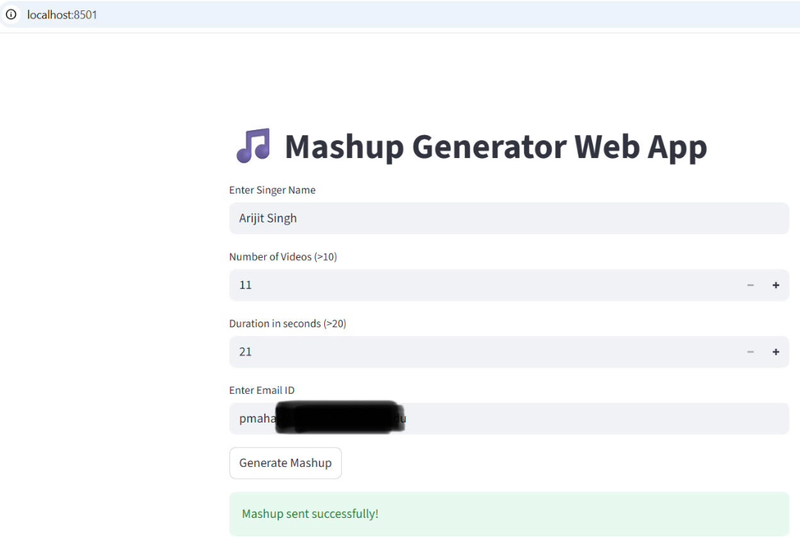
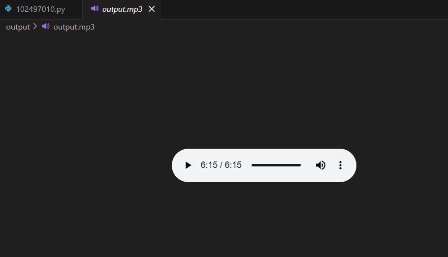
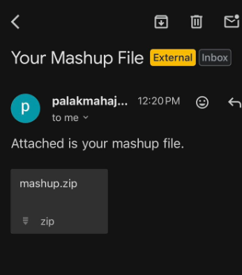

# 🎵 Mashup Generator   

---

## 📌 Project Overview

This project implements a **Mashup Generator** as per the assignment requirements.  
It consists of two independent parts:

- ✅ **Program 1 – Command Line Mashup Generator**
- ✅ **Program 2 – Web Application Mashup Generator**

Both programs successfully perform:

- Downloading N songs of a given singer from YouTube
- Extracting audio
- Trimming first Y seconds from each audio
- Merging trimmed audios into one mashup file
- Creating ZIP file (Web version)
- Sending ZIP via email (Web version)

---

# 🖥️ Program 1 – Command Line Application

## 🔹 Description

A Python-based CLI tool that:

- Downloads N videos of a singer
- Converts videos to audio
- Cuts first Y seconds from each audio
- Merges all trimmed audios into a single MP3 file

---

## 🔹 Usage
```bash
python 102497010.py "Singer Name" <NumberOfVideos> <DurationInSeconds> <OutputFileName.mp3>
```

Example:
```
python 102497010.py "Arijit Singh" 15 25 output.mp3
```

## 🔹 Validations Implemented

- Ensures correct number of command-line parameters
- Ensures NumberOfVideos > 10
- Ensures Duration > 20 seconds
- Ensures output file ends with `.mp3`
- Exception handling for download and processing errors
- Skips oversized files to prevent memory issues

---

# 🌐 Program 2 – Web Application (Streamlit)

## 🔹 Description

A Streamlit-based web application that allows users to:

- Enter Singer Name
- Enter Number of Videos (>10)
- Enter Duration (>20 seconds)
- Enter Email ID
- Generate mashup
- Automatically create ZIP file
- Send ZIP file via email

## 🔹 Run Locally
```
streamlit run app.py
```

---

## 📂 Project Structure
```
Program1/
│   ├── 102497010.py
│   └── requirements.txt

Program2/
│   ├── app.py
│   ├── mashup.py
│   └── requirements.txt

Screenshots/
│   ├── webpage.png
│   ├── output.png
│   └── mail.png

README.md
```

---

## ⚙️ Dependencies

**Program 1 Requirements**
```
yt-dlp
pydub
```

**Program 2 Requirements**
```
yt-dlp
pydub
streamlit
```

> **Note:** FFmpeg must be installed separately as a system dependency for audio processing.

---

## 🖼️ Proof of Execution

### 1️⃣ Web Application Interface



### 2️⃣ Mashup Output Generated



### 3️⃣ Email with ZIP Attachment



---

## 🚀 Key Functional Highlights

- Automated YouTube audio extraction
- Audio trimming and merging
- Streamlit interactive UI
- ZIP file generation
- Email integration using SMTP
- Proper input validation
- Exception handling
- Modular and clean code structure

---

## 🏁 Conclusion

This project successfully fulfills all assignment requirements:

✔ Command line mashup generator  
✔ Web-based mashup generator  
✔ Audio trimming and merging  
✔ ZIP file generation  
✔ Email delivery  
✔ Input validation and error handling  

---

## 👩‍💻 Developed By

**Palak Mahajan**
